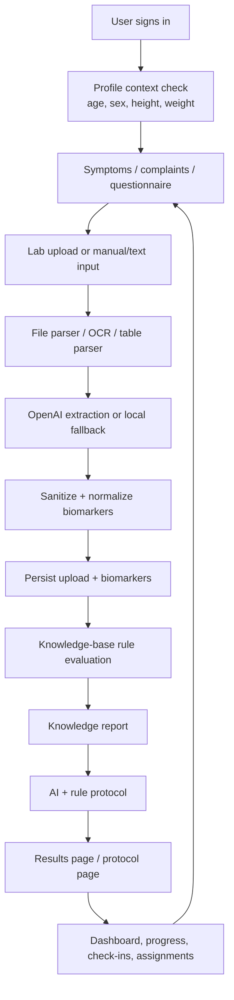

# VITALOOP Lab Analysis, Validation, Reporting, and Prediction Logic

Last updated: 2026-07-13
Source: current repository implementation in `/Users/oleksii/projects/vitaloop`

Architecture version: Shared Analysis Core V2
Production rollout date: 2026-07-12
Migration / commit reference:

- Supabase migration: `backend/migrations/20260712225326_create_knowledge_domain_registry.sql`
- Core rollout commits: `74fb8a5c`, `c0472820`, `c7ea8bc3`, `be0b98c8`

## 1. Purpose

This document describes the full analysis logic for VITALOOP lab uploads and related health-intelligence flows: input collection, file parsing, biomarker extraction, validation, normalization, knowledge-base evaluation, report generation, protocol creation, progress tracking, dashboard summaries, and prediction-like prioritization.

VITALOOP is not a diagnostic product. The system provides educational decision support: it prioritizes markers, explains possible connections, suggests follow-up questions, builds action-plan structure, and supports progress tracking.

## 2. User Journey: From Symptoms and Labs to Health Loop



The product goal is a continuous health loop:

1. Capture what the user feels.
2. Extract and normalize lab data.
3. Connect symptoms, biomarkers, profile, and knowledge-base rules.
4. Return plain-language interpretation and priorities.
5. Suggest safe next steps, doctor questions, retest windows, and progress tracking.
6. Recalibrate after check-ins, new labs, and new symptoms.

## 3. Supported Inputs

The analysis stack accepts several input types.

### 3.1 File Upload

Endpoint:

- `POST /analyze/upload`
- Alias: `POST /analyze/pdf`

Supported file formats:

- PDF: text-based and scanned.
- Images: PNG, JPG, JPEG, GIF, BMP, WEBP.
- Multipage images: TIFF/TIF.
- Tables: XLSX, XLS, CSV.

Request context:

- `file`
- optional `lab_name`
- optional `symptoms`
- bearer token
- locale headers

### 3.2 Raw Text Analysis

Endpoint family under `/analyze` accepts extracted lab text in `AnalyzeRequest`.

Fields:

- `extracted_text`
- optional `lab_name`
- optional `test_date`
- optional `ocr_confidence`
- optional `symptoms`

The text is normalized and fingerprinted for idempotency.

### 3.3 Manual Biomarker Entry

Manual biomarker entry is supported through request models such as `ManualAnalysisRequest` and `ManualBiomarkerEntryRequest`. It is routed through the same normalization, knowledge evaluation, report, and protocol pipeline after biomarker values are accepted.

### 3.4 Symptoms and Questionnaire

Symptoms can enter the system through:

- `/symptoms`: tags, severity, optional upload link.
- `/assessment`: public/UA self-assessment flows.
- `/questionnaire`: structured questionnaire sessions.
- `/checkins`: weekly check-in fields.
- Upload form symptoms, passed into `/analyze/upload`.

Symptoms are normalized to lower-case tags and connected to lab interpretation through knowledge rules and protocol generation.

## 4. Access Gates Before Analysis

Before a user can analyze labs, the backend checks:

1. Valid Supabase JWT via `get_current_user`.
2. Freemium or Premium analysis entitlement via `require_freemium_analyze`.
3. Biomarker quota through `BiomarkerService.check_freemium_biomarker_quota`.
4. Required medical profile context:
   - `age`
   - `sex`
   - `height_cm`
   - `weight_kg`

If profile context is incomplete, the API returns HTTP 422 with code:

```json
{
  "code": "PROFILE_CONTEXT_REQUIRED",
  "missing_fields": ["age", "sex", "height_cm", "weight_kg"]
}
```

The Ukrainian error explains that age, sex, height, and weight are required to distinguish pediatric and adult context and avoid unsafe recommendations.

## 5. File Validation and Parsing

`POST /analyze/upload` performs:

1. File extension validation against the supported set.
2. Empty-file check.
3. Temporary file creation with the original extension.
4. Analyzer selection through `create_file_analyzer(temp_path)`.
5. Analyzer execution through `file_analyzer.analyze(temp_path, symptoms=symptoms)`.
6. Error mapping to HTTP responses:
   - Invalid file type: 400 `INVALID_FILE_TYPE`.
   - Empty file: 400 `EMPTY_FILE`.
   - Analyzer creation failure: 400 `ANALYZER_CREATION_FAILED`.
   - Validation failure: 400 `FILE_VALIDATION_FAILED`.
   - Timeout: 408 `ANALYSIS_TIMEOUT`.
   - Analysis service unavailable: 503 `ANALYSIS_SERVICE_UNAVAILABLE`.
   - Vision disabled: 503 `VISION_API_DISABLED`.
   - Unknown analyzer error: 500 `ANALYSIS_UNKNOWN_ERROR`.

Analyzer metadata can include:

- `analysis_method`
- `analysis_time`
- `document_parser`
- `document_input_chars`
- `document_chunks`
- `summary`
- `top_priority`
- `retest_schedule`

## 6. LLM Extraction Logic

OpenAI extraction is implemented through legacy-named `backend/app/services/claude_service.py`.

Important details:

- The filename is legacy; active LLM configuration is OpenAI.
- Prompts are loaded from `backend/app/prompts`.
- `EXTRACT_PROMPT_VERSION = "extract_v1"`.
- `PROTOCOL_PROMPT_VERSION = "protocol_v1"`.
- The system prompt requires valid JSON only, no markdown or commentary.
- `build_biomarker_extraction_knowledge_context()` can add knowledge-base marker/rule hints into extraction context.

The extraction system returns biomarkers with the expected shape:

- `name`
- `value`
- `unit`
- optional `ref_low`
- optional `ref_high`
- optional `reference_range`
- `status`
- `category`

If OpenAI is not configured or extraction fails in a recoverable way, local regex fallback extraction can parse common lab-row formats.

## 7. Sanitization of Extracted Biomarkers

After parsing, `_sanitize_extracted_biomarkers()` filters and cleans raw biomarkers.

Rules:

- Skip non-dict rows.
- Require a non-empty biomarker name.
- Require numeric value or extract numeric value from a mixed string.
- Require a unit.
- Deduplicate names; if duplicate, append unit or `#2`, `#3`, etc.
- Parse `ref_low` and `ref_high` directly or from `reference_range`.
- Normalize status to one of:
  - `OPTIMAL`
  - `BORDERLINE`
  - `DEFICIENT`
  - `ELEVATED`
- Infer status from value/reference range when possible.
- Normalize category to allowed categories.

Allowed categories include:

- `blood_count`
- `metabolic`
- `lipids`
- `liver`
- `kidney`
- `thyroid`
- `vitamins`
- `minerals`
- `hormones`
- `inflammation`
- `electrolytes`
- `urinalysis`
- `coagulation`
- `other`

If no biomarkers remain after sanitization, the API returns HTTP 422 with code `BIOMARKERS_NOT_EXTRACTED`.

## 8. Persistence Flow

For file upload analysis, the backend persists data in this order:

1. `save_lab_upload(...)`
   - user id
   - extracted metadata JSON
   - lab name or filename
   - prompt/version metadata
2. `save_biomarkers(upload_id, user_id, biomarkers)`
3. `run_lab_analysis_pipeline(...)`
4. `save_protocol(...)` when a protocol is generated
5. `save_timeline_event(...)` with event type `lab_analyzed`

If a failure occurs after upload creation, the upload status can be updated to `failed`.

Every protected read/write path should remain user-scoped. Upload-specific read paths assert ownership before returning biomarkers or generating protocols.

## 9. Biomarker Normalization Pipeline

`run_lab_analysis_pipeline()` starts by calling `normalize_biomarkers()`.

Normalization includes:

- Display-name cleanup.
- Name alias mapping.
- Canonical name mapping via `to_canonical_name`.
- Canonical names prefixed as `canonical_*` where needed.
- Unit normalization:
  - `ug/l`, `mcg/l`, `ng/ml` -> `ng/mL`
  - `mg/dl` -> `mg/dL`
  - `g/dl` -> `g/dL`
  - `u/l`, `iu/l`, `miu/l` -> normalized forms
  - `µ`/`μ` normalization
- Vitamin D conversion:
  - `nmol/L` to `ng/mL` by dividing by 2.5.
- Reference-range parsing from separate fields or text.
- Reference conversion when value units are converted.
- Status inference:
  - below reference low -> `DEFICIENT`
  - above reference high -> `ELEVATED`
  - inside range -> `OPTIMAL`
  - missing reference/status ambiguity -> `BORDERLINE`
- Category inference from canonical names and keyword groups.

The normalized output is the canonical input to prioritization, knowledge evaluation, report building, and protocol generation.

## 10. Knowledge-Base Evaluation

Knowledge evaluation is implemented through:

- `backend/app/services/knowledge/integration.py`
- `backend/app/services/knowledge/evaluator.py`
- `backend/app/services/knowledge/report.py`

### 10.1 Input Conversion

`biomarkers_to_knowledge_lab_results()` converts biomarker rows into:

```json
{
  "ferritin": {
    "value": 18,
    "unit": "ng/mL",
    "source_name": "Ferritin",
    "status": "DEFICIENT"
  }
}
```

Marker aliases include examples such as:

- `vitamin_d_25_oh` -> `vitamin_d`
- `25_oh_vitamin_d` -> `vitamin_d`

### 10.2 Person Avatar

The evaluator builds a deidentified person avatar from profile:

- `age_band`
- `sex`
- `bmi_band`
- `goals`
- `cohort_learning_allowed`

This lets the knowledge layer use context without passing the raw complete profile everywhere.

### 10.3 Rule Loading

Active rules are loaded from `knowledge_rules` where:

- `active = true`
- `governance_status = active`

Rule fields include:

- `key`
- `name`
- `description`
- `input_entities`
- `conditions`
- `outputs`
- `confidence`
- `severity`
- `requires_doctor`
- `explanation_template`
- `source`
- `source_url`

### 10.4 Rule Condition Engine

Rules support condition trees:

- `all`: every nested condition must match.
- `any`: at least one nested condition must match.
- Atomic lab-marker conditions:
  - `lab_marker`
  - `operator`: `lt`, `lte`, `gt`, `gte`, `eq`, `between`
  - `value`
  - optional `unit`
- Atomic symptom conditions:
  - `symptom`

The evaluator can convert selected units before comparison:

- glucose: `mmol/L` <-> `mg/dL`
- LDL/HDL: `mmol/L` <-> `mg/dL`
- triglycerides: `mmol/L` <-> `mg/dL`
- vitamin D: `nmol/L` <-> `ng/mL`
- ferritin: `ng/mL` <-> `ug/L`

### 10.5 Recommendations

Matched rules output recommendation keys. The evaluator loads matching rows from `recommendations` and returns:

- title
- body
- category
- priority
- requires_doctor
- evidence_level
- source
- source_url

### 10.6 Confidence

The evaluator computes confidence from:

- Maximum matched rule confidence.
- Evidence quality from condition matching.
- Severity multiplier.
- Lab freshness.
- Missing-data penalty.
- Recommendation evidence level.

Confidence is capped to 0.0-1.0.

### 10.7 Safety Alerts

The evaluator emits safety alerts for selected high-risk values. Examples:

- Glucose >= 300 mg/dL or <= 54 mg/dL.
- HbA1c >= 9.0%.
- ALT >= 150 U/L.
- AST >= 120 U/L.
- LDL >= 190 mg/dL.
- Vitamin D < 10 ng/mL.

Safety alerts always use medical-review language and require clinician discussion.

## 11. Knowledge Report

`build_knowledge_report()` turns normalized biomarkers and knowledge evaluation into user-facing report sections.

Output version:

- `knowledge_report_v1`

Main sections:

- `summary`
  - headline
  - risk level
  - confidence
  - confidence label
  - requires doctor
  - disclaimer
- `what_was_found`
  - total count
  - optimal count
  - borderline count
  - deficient count
  - elevated count
  - flagged markers
- `why_it_matters`
  - matched health patterns
  - summary
  - explanation
  - severity
  - confidence
  - source references
- `action_plan`
  - rule-based recommendations
  - fallback recommendations when no rule matches
- `doctor_discussion`
  - suggested questions/topics for doctor discussion
- `retest_plan`
  - marker-specific retest timing and reason
- `safety_alerts`
- `source_references`

### 11.1 Ukrainian Localization

For locale `uk`, the report builder localizes:

- Status labels.
- Confidence labels.
- Headline copy.
- Disclaimers.
- Known rule translations.
- Known recommendation translations.
- Fallback interpretation and action-plan copy.

Example Ukrainian status labels:

- `DEFICIENT`: `нижче референсу`
- `ELEVATED`: `вище референсу`
- `BORDERLINE`: `потребує спостереження`
- `OPTIMAL`: `у межах референсу`

## 12. Prioritization Logic

The pipeline prioritizes biomarkers by status:

1. `DEFICIENT`
2. `ELEVATED`
3. `BORDERLINE`
4. `OPTIMAL`

Optimal markers are not included in the priority list. Non-optimal markers are mapped to:

- high priority for `DEFICIENT` and `ELEVATED`
- medium priority for `BORDERLINE`
- low priority for `OPTIMAL`, though optimal markers are usually skipped

Prioritized output includes:

- name
- canonical name
- value
- unit
- status
- category
- priority
- rationale
- reference range

This prioritization is not diagnosis. It is a triage layer for what to review, monitor, or discuss first.

## 13. Protocol Generation

Protocol generation combines:

- Rule-based action plan from the knowledge report.
- AI-generated protocol items from OpenAI.
- Local fallback templates if LLM is unavailable.

The AI protocol call receives:

- normalized biomarkers
- normalized symptoms
- user profile
- user id
- upload id

Generated protocol sections:

- `nutrition`
- `supplements`
- `lifestyle`
- `training_recovery`

Protocol items can include:

- supplement
- dosage
- timing
- priority
- rationale
- iHerb search term
- category/source metadata

Important safety rule:

- Supplement guidance should be contextual and conservative. The report fallback explicitly says not to start iron, B12, folate, or high-dose vitamin D from one indirect marker alone without confirmation and doctor discussion.

## 14. Protocol API

Endpoint:

- `POST /protocol`

Input:

- `upload_id`
- `symptoms`

Access gates:

- authenticated user
- active subscription for end users
- upload ownership check

Flow:

1. Assert upload belongs to user.
2. Return cached protocol if one already exists.
3. Load biomarkers for upload.
4. Generate recommendations with timeout protection.
5. Enrich supplement recommendations with affiliate URL.
6. Save protocol.
7. Audit create/read event.

Failure modes:

- 404 `BIOMARKERS_NOT_FOUND`
- 504 `PROTOCOL_TIMEOUT`
- 502 `PROTOCOL_UPSTREAM_FAILED`
- 422 `PROTOCOL_EMPTY`
- 500 `PROTOCOL_SAVE_FAILED`

## 15. Analysis Response Shape

File analysis returns a comprehensive payload:

- `upload_id`
- `biomarkers`
- `top_priority`
- `protocol`
- `retest_schedule`
- `summary`
- `analysis_time`
- `analysis_method`
- `analysis_source`
- `knowledge_evaluation`
- `knowledge_report`
- `final_analysis`

`final_analysis` contains:

- `analysis_id`
- `status`
- `health_summary`
- `prioritized_biomarkers`
- `risks_flags`
- `recommendations`
- `protocol`
- `ai_protocol`
- `retest_suggestions`
- `doctor_summary`
- `knowledge_evaluation`
- `knowledge_report`
- `disclaimer`
- `normalized_biomarkers`
- `cost_metadata`
- `metadata`

## 16. Result Read Path

Results pages load persisted uploads/biomarkers and can reconstruct or augment report output using the current report logic. This matters because older uploads may have been processed before the latest knowledge-report format.

Expected read behavior:

- Verify authenticated user.
- Verify upload ownership.
- Load biomarkers by upload.
- Load existing protocol when available.
- Return biomarkers, report-ready sections, protocol, retest plan, and metadata.
- Avoid unnecessary repeated LLM calls when a protocol already exists.

## 17. Dashboard, Progress, and Forecasting Logic

VITALOOP currently performs prediction-like behavior through trends, priorities, retest scheduling, and next-best actions. It is not a formal medical prognosis engine.

### 17.1 Dashboard Summary

`GET /dashboard/summary` aggregates:

- health score
- health score change
- active program status
- completed tasks
- active assignments
- total uploads
- insights count
- questionnaire score
- subscription status
- streak days
- goals count
- onboarding stage
- next-best action
- start-here block
- latest upload
- latest check-in
- latest questionnaire
- recent progress
- insights

### 17.2 Health Score

If no latest health score exists, the backend can calculate one through `calculate_health_score(user_id)`. The dashboard then shows the latest score and delta where available.

### 17.3 Progress

Progress uses user biomarker history and uploads to display trends over time. The product uses repeated labs and check-ins to make the loop useful after the first report.

### 17.4 Weekly Check-Ins

`/checkins` captures:

- week start
- energy score
- sleep quality
- mood score
- symptom changes
- protocol adherence
- new complaints
- notes

Premium/subscription gating applies to check-ins.

### 17.5 Retest Planning

The report recommends retest windows based on marker status and category:

- vitamins, minerals, metabolic, lipids: often 8-12 weeks
- liver, kidney, thyroid, hormones: often 4-8 weeks
- other: often 6-12 weeks
- safety alerts: as soon as clinically appropriate

This retest plan is a planning aid, not medical instruction.

### 17.6 Next-Best Action

Dashboard next-best-action logic prioritizes:

1. Continue onboarding if incomplete.
2. Upload first lab if no progress exists.
3. Complete active assignments.
4. Run weekly check-in.

## 18. Symptoms and Complaint Logic

`POST /symptoms` records:

- optional `upload_id`
- symptom `tags`
- `severity` from 1 to 10

If `upload_id` is provided, ownership is verified.

The backend also provides:

- user symptom summary over a bounded day window
- platform symptom summary for super admins only

Recurring complaints are part of onboarding and help decide whether the first health loop has started.

## 19. Medical Safety Language

The system enforces conservative wording:

- Avoid confirmed diagnosis language.
- Use "possible risk", "possible link", "requires medical review", "discuss with a qualified clinician".
- Reports include educational disclaimers.
- High-risk values create safety alerts and doctor-discussion prompts.
- Supplement advice must be framed as safe ranges and confirmation-first, especially for iron, B12, folate, and high-dose vitamin D.

## 20. Error and Edge-Case Matrix

| Scenario | Response / behavior |
| --- | --- |
| Missing/invalid JWT | 401 |
| End-user lacks subscription for gated feature | 402 `SUBSCRIPTION_REQUIRED` |
| Freemium biomarker quota exceeded | 402 `BIOMARKER_QUOTA_EXCEEDED` |
| Missing profile context before analysis | 422 `PROFILE_CONTEXT_REQUIRED` |
| Invalid file type | 400 `INVALID_FILE_TYPE` |
| Empty file | 400 `EMPTY_FILE` |
| Analyzer cannot be created | 400 `ANALYZER_CREATION_FAILED` |
| Analyzer validation error | 400 `FILE_VALIDATION_FAILED` |
| Analysis timeout | 408 `ANALYSIS_TIMEOUT` |
| Analysis service unavailable | 503 `ANALYSIS_SERVICE_UNAVAILABLE` |
| Vision disabled | 503 `VISION_API_DISABLED` |
| No biomarkers extracted | 422 `BIOMARKERS_NOT_EXTRACTED` |
| Upload not owned by user | 403/404 depending service path |
| No biomarkers for protocol | 404 `BIOMARKERS_NOT_FOUND` |
| Protocol generation timeout | 504 `PROTOCOL_TIMEOUT` |
| Protocol upstream error | 502 `PROTOCOL_UPSTREAM_FAILED` |
| Empty protocol | 422 `PROTOCOL_EMPTY` |

## 21. Cost Metadata

The pipeline estimates LLM usage and cost:

- prompt tokens estimated from biomarker/symptom payload size
- completion tokens estimated from AI protocol size
- estimated cost based on active model
- LLM configured flag
- model name

This is an estimate, not provider billing truth.

## 22. UA-Specific Analysis Behavior

When the frontend sends Ukrainian locale headers, the backend:

- returns Ukrainian profile-context error text
- builds Ukrainian knowledge-report copy
- uses Ukrainian status labels
- returns Ukrainian disclaimers and fallback guidance
- keeps the same biomarker, rule, protocol, and safety logic as EN

The correct architecture is one shared analysis engine with localized presentation and report copy.

## 23. Current Limitations and Improvement Areas

1. The active OpenAI service is still housed in a legacy file named `claude_service.py`.
2. Pediatric vs adult interpretation is protected by required profile context, but deeper pediatric reference ranges depend on the available knowledge-base and lab reference data.
3. The quality of report recommendations depends heavily on the completeness of `knowledge_rules` and `recommendations`.
4. Some fallback protocol examples include fixed supplement dosage. These must be kept conservative and ideally profile-aware before production-level personalization.
5. Current prediction is priority/trend/retest planning, not formal disease-risk forecasting.
6. Old uploads may need report reconstruction if the frontend expects the newest report format.
7. UA report quality depends on consistent `X-Vitaloop-Locale: uk` from every UA route and API call.

## 24. Ideal Target State for "Useful for Ukrainians"

To make the UA direction strong without changing core architecture:

- Keep the shared backend analysis engine.
- Keep UA frontend fully localized and free from stale EN shells.
- Require profile context before every analysis.
- Expand Ukrainian knowledge-rule translations.
- Expand Ukrainian recommendation copy with local lab formats and clinician-discussion language.
- Improve report UI so users see:
  - extracted markers
  - reference ranges
  - what is stable
  - what needs attention
  - possible symptom connections
  - nutrition foundations
  - supplement safety notes
  - doctor questions
  - retest plan
  - progress loop
- Preserve medical disclaimers and avoid diagnosis.

## 25. Shared Analysis Core V2: Current Production Shape

The shared analysis core now returns and persists the following structured artifacts for B2C and B2B:

- `health_context`: normalized context across biomarkers, symptoms, questionnaire, profile, safety context, locale, and source metadata.
- `health_states`: deterministic domain scoring across iron status, metabolic health, cardiovascular, inflammation, thyroid, liver, kidney, micronutrients, and recovery/energy.
- `trend_analysis`: longitudinal biomarker comparison against prior saved biomarkers when history exists.
- `ai_orchestration`: wrapper metadata around protocol AI generation, including fallback status and context snapshot.
- `protocol`: enriched recommendation sections with `based_on`, `safety_notes`, `expected_timeline`, `retest_markers`, and knowledge-domain context.
- `quality_snapshot`: compact analytics artifact for coverage, safety, AI source, cost, top domains, and priority trends.

The core path is:

```text
Normalize biomarkers
  -> Build health_context
  -> KB evaluation
  -> Knowledge report
  -> Trend analysis
  -> Health state scoring
  -> AI orchestration
  -> Rule/AI protocol merge
  -> Safety validation
  -> Protocol enrichment
  -> Final safety validation
  -> Explainability + quality snapshot
  -> Persist report version / B2B result
```

### Managed Knowledge Domain Registry

Health domains are no longer hardcoded inside the health-state engine. The backend now resolves domain definitions through:

1. Supabase table `knowledge_domain_registry`, when active managed rows exist.
2. Versioned code registry fallback, when the table is absent or unavailable.

The registry controls:

- domain key and label
- biomarker aliases
- symptom aliases
- required markers
- retest markers
- protocol sections
- expected timeline
- evidence level
- doctor-required flag

Production has been seeded with 9 active managed domains using `managed_seed_v1`.

### Operational Signals

Backend logs should be monitored for:

- `analysis_core_completed`
- registry source/version/domain count
- quality snapshot coverage
- AI fallback rate
- safety event and warning counts

If managed registry loading fails, analysis remains available through code fallback.
