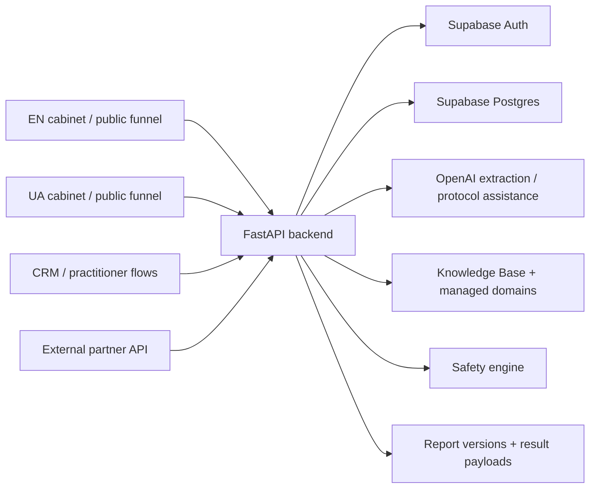
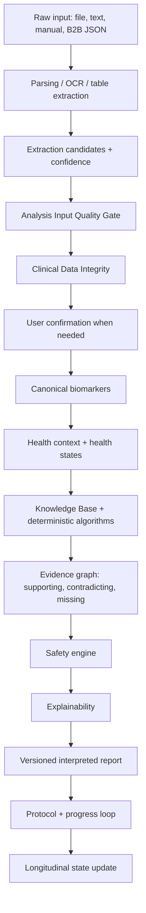

# VITALOOP Health Intelligence Core: Input To Result Pipeline

Last updated: 2026-08-13
Source: current repository implementation in `/Users/oleksii/projects/vitaloop`
Canonical owner document: this file is the single source of truth for how VITALOOP turns cabinet or external inputs into user-visible analysis, reports, protocols, progress, and follow-up guidance.

## 1. Purpose

This document describes the current VITALOOP health-intelligence mechanism from raw input to final output. It covers B2C EN/UA cabinet flows, manual/text/file input, B2B parsed-biomarker requests, OpenAI extraction, deterministic fallback logic, biomarker normalization, Knowledge Base evaluation, health-state interpretation, safety review, explainability, report versioning, protocol generation, and result rendering.

VITALOOP is educational decision support. It does not diagnose, prescribe treatment, or replace a qualified clinician. Product copy and backend safety checks should use language such as "possible connection", "worth discussing", "priority for review", and "educational interpretation".

## 2. One Shared Core, Multiple Surfaces

All production surfaces use the same backend health-intelligence core.



Presentation differs by domain and locale. Medical logic must not fork by locale or frontend. EN, UA, CRM, and B2B improvements should flow through the shared backend pipeline.

## 3. Supported Input Channels

### 3.1 B2C File Upload

Primary endpoints:

- `POST /analyze/upload`
- `POST /analyze/pdf` alias

Supported file families in current backend/frontend flow:

- PDF: text-based and scanned.
- Images: PNG, JPG/JPEG, GIF, BMP, WEBP.
- Multipage images: TIFF/TIF.
- Tables: XLS, XLSX, CSV.

Request context:

- `file`
- optional `lab_name`
- optional `symptoms`
- bearer token from Supabase Auth
- locale headers: `X-Vitaloop-Locale`, `Accept-Language`

### 3.2 B2C Raw Text Analysis

Text analysis endpoints under `/analyze` accept extracted lab text, lab name, date, OCR confidence, and symptoms. Text is normalized/fingerprinted to reduce duplicate analysis issues and then routed into the same extraction and pipeline stages.

### 3.3 Manual Biomarker Entry

Manual entry models such as `ManualAnalysisRequest` and `ManualBiomarkerEntryRequest` accept user-provided biomarker rows. Once accepted, manual rows use the same biomarker normalization, KB evaluation, safety, report, and protocol pipeline as file uploads.

### 3.4 Symptoms, Questionnaire, Assessment, Check-ins

Symptom/context signals enter through:

- `/symptoms`
- `/assessment`
- `/questionnaire`
- `/checkins`
- upload form symptoms

These signals are normalized and passed into the health context, Knowledge Base evaluation, protocol orchestration, explainability, and progress logic.

### 3.5 External B2B Input

Primary endpoint:

- `POST /v1/b2b/analyze-labs`

Current B2B MVP accepts parsed JSON biomarkers, not raw PDFs/files. Partner requests pass through the same `run_lab_analysis_pipeline()` after partner authentication, idempotency checks, partner biomarker alias mapping, request hashing, and usage/audit tracking.

B2B output is a structured analysis response with normalized biomarkers, knowledge report, safety context, protocol/action structure, doctor discussion points, retest suggestions, cost/quality metadata, and persisted partner insight records.

## 4. Locale Resolution

Locale resolution is implemented in `backend/app/utils/locale.py`.

Priority:

1. `X-Vitaloop-Locale`
2. `Accept-Language`
3. `Origin` / `Referer` containing `ua.vitaloop.today`
4. default `en`

UA requests should send `X-Vitaloop-Locale: uk` and `Accept-Language: uk`. If these headers are missing but the request origin/referer is `ua.vitaloop.today`, backend output defaults to Ukrainian where localization exists.

## 5. Access Gates Before Analysis

Before analysis, protected B2C routes validate:

1. Supabase JWT via `get_current_user`.
2. Upload ownership for upload-specific reads/writes.
3. Freemium/Premium entitlement through `require_freemium_analyze`.
4. Biomarker quota through `BiomarkerService.check_freemium_biomarker_quota`.
5. Required profile context for safer interpretation:
   - `age`
   - `sex`
   - `height_cm`
   - `weight_kg`

If required profile context is missing, the API returns `422 PROFILE_CONTEXT_REQUIRED`. This exists to avoid unsafe adult/pediatric interpretation and weak recommendations.

## 6. File Validation And Analyzer Selection

`POST /analyze/upload` performs:

1. Extension validation against the supported file set.
2. Empty-file check.
3. Temporary file creation with the original extension.
4. Analyzer selection with `create_file_analyzer(temp_path)` in `backend/app/services/claude_pdf_analyzer.py`.
5. Analyzer execution with `file_analyzer.analyze(temp_path, symptoms=symptoms)`.
6. Error mapping:
   - `400 INVALID_FILE_TYPE`
   - `400 EMPTY_FILE`
   - `400 ANALYZER_CREATION_FAILED`
   - `400 FILE_VALIDATION_FAILED`
   - `408 ANALYSIS_TIMEOUT`
   - `503 ANALYSIS_SERVICE_UNAVAILABLE`
   - `503 VISION_API_DISABLED`
   - `500 ANALYSIS_UNKNOWN_ERROR` or `ANALYZE_EXECUTION_FAILED`

The analyzer file still has a legacy name, but current code uses OpenAI-compatible analyzer classes and OpenAI service configuration.

## 7. AI Service Boundary

Current clean AI import path:

- `backend/app/services/ai/openai_service.py`

Compatibility path still exists:

- `backend/app/services/claude_service.py`

New code should import from `app.services.ai.openai_service`. Existing legacy imports remain supported to avoid breaking older routes/tests.

OpenAI is used for:

- biomarker extraction from raw text or document chunks;
- vision/scanned report extraction where enabled;
- questionnaire follow-up/summary assistance;
- protocol assistance through `ai_orchestrator`.

The system also has deterministic fallback extraction for recoverable cases where OpenAI is unavailable or insufficient.

## 8. Biomarker Extraction And Sanitization

Extraction returns candidate biomarker rows with:

- `name`
- `value`
- `unit`
- `ref_low`
- `ref_high`
- `reference_range`
- `status`
- `category`

`_sanitize_extracted_biomarkers()` then:

- skips malformed rows;
- requires non-empty name;
- requires numeric value or parses numeric value from mixed strings;
- requires unit;
- parses reference ranges;
- deduplicates names;
- infers status from value/range when possible;
- normalizes statuses to `OPTIMAL`, `BORDERLINE`, `DEFICIENT`, `ELEVATED`;
- normalizes categories such as blood count, metabolic, lipids, liver, kidney, thyroid, vitamins, minerals, hormones, inflammation, electrolytes, urinalysis, coagulation, or other.

If no valid biomarker remains, the API returns `422 BIOMARKERS_NOT_EXTRACTED`.

## 9. Extraction Candidates And Confidence

Before final biomarkers are saved, extracted rows are mirrored into `biomarker_extraction_candidates` where schema is available.

Service code:

- `backend/app/services/analysis_candidates.py`
- `save_biomarker_extraction_candidates(...)`
- `get_biomarker_extraction_candidates(...)`
- `update_biomarker_extraction_candidates(...)`

Candidate fields include:

- `upload_id`
- `user_id`
- `source`: `regex`, `table`, `ai`, or `manual`
- `raw_name`
- `raw_value`
- `raw_unit`
- `raw_reference_range`
- `parsed_value`
- `confidence_score`
- `confidence_reasons`
- `status`: `pending`, `confirmed`, `rejected`, `corrected`
- `source_page`
- `source_row`
- `created_at`

Confidence scoring uses:

- known biomarker name match;
- numeric value exists;
- recognized unit;
- reference range present;
- deterministic/AI agreement;
- source row/page location.

Labels:

- `high`: score >= 0.80
- `medium`: score >= 0.55
- `low`: score < 0.55

User confirmation endpoints:

- `GET /analyze/{upload_id}/candidates`
- `POST /analyze/{upload_id}/confirm-candidates`

Low-confidence candidates should require confirmation in the UX. High-confidence cases currently continue through the existing flow to avoid blocking reports.

## 10. Persistence Order For B2C Uploads

For file upload analysis, backend writes are ordered roughly as:

1. `save_lab_upload(...)` with metadata/prompt version.
2. `save_biomarker_extraction_candidates(...)` best-effort.
3. `save_biomarkers(upload_id, user_id, biomarkers)`.
4. `run_lab_analysis_pipeline(...)` with `persist_knowledge=True`, `persist_report_version=True`.
5. `save_protocol(...)` when protocol output exists.
6. `save_timeline_event(...)` with `lab_analyzed`.

If candidate or report-version persistence fails, the user-facing upload flow should not break unless the core upload/biomarker save fails.

## 11. Normalization Pipeline

`run_lab_analysis_pipeline()` begins with `normalize_biomarkers()` in `backend/app/services/lab_analysis_pipeline.py`.

Normalization includes:

- display-name cleanup;
- alias mapping;
- canonical name mapping with `to_canonical_name`;
- canonical names prefixed as `canonical_*` where needed;
- unit normalization;
- vitamin D conversion from `nmol/L` to `ng/mL`;
- reference range parsing/conversion;
- status inference from reference bounds;
- category inference from marker name/canonical name;
- duplicate-safe naming.

The normalized biomarker list is the canonical input to prioritization, Knowledge Base evaluation, safety, report interpretation, protocol generation, and trend analysis.

## 12. Health Context

`build_health_context(...)` combines:

- normalized biomarkers;
- normalized symptoms;
- questionnaire answers;
- user profile fields;
- source metadata;
- locale.

This creates a structured context object used by KB evaluation, health-state scoring, AI protocol orchestration, safety, report interpretation, quality snapshots, and report-version input snapshots.

## 13. Knowledge Base Evaluation

Knowledge evaluation is implemented through:

- `backend/app/services/knowledge/integration.py`
- `backend/app/services/knowledge/evaluator.py`
- `backend/app/services/knowledge/report.py`
- `backend/app/services/knowledge/domain_registry.py`
- `backend/app/services/knowledge/nutrition_algorithms.py`

The KB layer evaluates normalized biomarkers and symptoms against:

- `knowledge_rules`;
- `recommendations`;
- lab marker aliases/reference ranges;
- managed domain registry definitions;
- runtime deterministic nutrition algorithms.

Rule/evaluation outputs can include matched rules, generated recommendations, confidence, safety alerts, doctor discussion points, retest plan, action plan, and source/evidence metadata where available.

Runtime nutrition logic works without waiting for seed/sync. Seeded KB rules improve depth and governance but are not the only source of interpretation.

## 14. Managed Domain Registry And Health States

`resolve_domain_definitions()` loads managed health domains where available. `evaluate_health_states(...)` groups biomarker and symptom context into health-state domains such as iron status, inflammation, kidney, liver, metabolic health, and blood-count context.

The managed registry can define:

- domain aliases;
- required markers;
- retest markers;
- protocol sections;
- expected timelines;
- evidence levels;
- clinician escalation hints.

When registry rows are missing, deterministic fallback logic still produces a conservative report.

## 15. Prioritization And Trends

The pipeline prioritizes biomarkers by status/risk using deterministic ordering and context.

Trend analysis is handled by `evaluate_biomarker_trends(...)` using current biomarkers plus historical biomarkers loaded by user id.

Rules:

- One data point is a baseline, not a trend.
- Trend output requires comparable historical values.
- Trend conclusions must not imply prognosis.

## 16. Protocol Generation

Protocol output combines:

1. Rule-based recommendations from the knowledge report.
2. AI-assisted protocol items from `generate_ai_protocol_orchestrated(...)` when enabled.
3. Deterministic fallback protocol sections.
4. `enrich_protocol(...)` additions: safety, evidence, retest hints, health-state context, explainability hooks.

Protocol sections are expected to support user-facing views such as:

- today / current step;
- this week;
- this month;
- retest plan;
- doctor discussion;
- long-term habits;
- safety notes.

The protocol must avoid unreviewed diagnosis-like statements and unsafe supplement dosing, especially for pediatric or pregnancy contexts.

## 17. Safety Engine

Safety lives in `backend/app/services/safety/safety_engine.py`.

Functions:

- `validate_report(...)`
- `validate_protocol(...)`
- `validate_recommendation(...)`

Safety checks include:

- dangerous lab values such as very high/low glucose, high HbA1c, high ALT/AST, very high LDL, severe vitamin D insufficiency;
- pediatric context;
- pregnancy context;
- current medications;
- current supplements;
- allergies;
- prior diagnoses;
- sensitive supplement categories: iron, vitamin D, B12, folate;
- explicit dosage wording;
- diagnosis-like wording.

Safety result shape:

```json
{
  "status": "approved | approved_with_warnings | blocked",
  "warnings": [],
  "blocked_items": [],
  "doctor_discussion_required": true,
  "safety_events": []
}
```

Safety runs after KB/AI/rule protocol generation and before report-version persistence. Safety events are persisted through `save_safety_events(...)` where schema exists.

## 18. Explainability Engine

Explainability lives in `backend/app/services/explainability/engine.py`.

Functions:

- `build_marker_explanation(...)`
- `build_recommendation_explanations(...)`

Explanations include:

- triggered biomarker;
- symptom signal;
- profile signal;
- matched rule key;
- confidence;
- evidence level/source where available;
- missing profile/context;
- safety notes.

The result is exposed as `explainability` and persisted in `report_versions` where available. UI should use this for "Why this appears" / "Чому це в звіті?" instead of generic filler text.

## 19. Interpreted Report Layer

`backend/app/services/report_interpretation.py` builds a more human-readable report object on top of normalized biomarkers, KB output, health states, safety, explainability, and profile context.

Purpose:

- turn raw marker findings into a coherent narrative;
- handle specific known patterns such as isolated low reticulocyte volume indices;
- distinguish "what this may mean" from "what this does not confirm";
- surface missing context;
- produce EN/UA copy;
- keep pediatric and supplement safety conservative.

The frontend should prefer `interpreted_report` and `knowledge_report` over inventing conclusions from the raw biomarker table.

## 20. Report Versions

Report-version persistence is implemented in `backend/app/services/supabase_service.py`:

- `save_report_version(...)`
- `get_latest_report_version(upload_id, user_id, locale)`
- `get_report_version(report_version_id, user_id)`

Each version stores:

- `user_id`
- `upload_id`
- `version`
- `locale`
- `input_snapshot`
- `knowledge_report`
- `protocol`
- `safety_result`
- `explainability`
- `interpreted_report`
- `status`
- `created_at`

Input snapshots include biomarkers, symptoms, profile-context fields, source metadata, health context, health states, trend analysis, AI orchestration, quality snapshot, cost metadata, and knowledge-domain metadata.

Report reads should prefer persisted report versions where available, so old uploads do not silently change when logic evolves.

## 21. Output Payload

`run_lab_analysis_pipeline()` returns a rich result object containing:

- `analysis_id`
- `status`
- `health_summary`
- `trend_analysis`
- `health_states`
- `prioritized_biomarkers`
- `risks_flags`
- `recommendations`
- `protocol`
- `ai_protocol`
- `ai_orchestration`
- `shopping_links`
- `retest_suggestions`
- `doctor_summary`
- `knowledge_evaluation`
- `knowledge_report`
- `interpreted_report`
- `safety_result`
- `explainability`
- `disclaimer`
- `normalized_biomarkers`
- `cost_metadata`
- `quality_snapshot`
- `health_context`
- `metadata`
- optional `report_version`

User-facing report screens should lead with human meaning and next steps, then show detailed biomarkers. They should not lead with only "N biomarkers found".

## 22. Results UX Contract

The frontend report should display, in this order when data exists:

1. Short human summary: what is happening.
2. Main interpretation: what the pattern may mean and what it does not confirm.
3. Important context gaps: missing markers/profile/symptoms that limit confidence.
4. Top findings: only the most relevant markers first.
5. Next best step: today/this week/this month/retest.
6. Questions for clinician.
7. Safety/disclaimer.
8. Explainability/source/evidence.
9. Full biomarker table.
10. Download/export report.

The UI must avoid duplicating generic sections. If a block cannot add specific value, hide it or label it clearly as missing context.

## 23. Dashboard, Progress, Check-ins

After analysis, results feed:

- `/dashboard/summary`: next best step and loop status;
- `/lab-results`: upload history and marker status summary;
- `/results/{upload_id}`: report view;
- `/protocol/{upload_id}`: action plan/protocol;
- `/progress`, `/timeline`, `/insights`: longitudinal tracking;
- `/checkins`: weekly subjective feedback.

The loop is intended to continue: symptoms, new uploads, check-ins, protocol adherence, and retests improve future interpretation.

## 24. Cost And Quality Metadata

The pipeline builds:

- `cost_metadata` through `_cost_metadata(...)` and `record_analysis_cost(...)`;
- `quality_snapshot` through `build_analysis_quality_snapshot(...)`.

These objects support observability, debugging, and future product quality reporting. They should not be exposed to users as raw technical jargon.

## 25. Current Database / Migration Reality

The code expects optional persistence tables such as:

- `report_versions`
- `biomarker_extraction_candidates`
- `safety_events`
- Knowledge Base tables from `backend/sql/stage-18-knowledge-base-foundation.sql`
- managed domain registry from `backend/migrations/20260712225326_create_knowledge_domain_registry.sql`
- B2B partner tables from `backend/sql/stage-17-partner-integration-mvp.sql` and `backend/sql/stage-24-b2b-analyze-labs.sql`

Not every schema object is represented as a numbered migration under `backend/migrations`. Some schemas are kept under `backend/sql`. When deploying to Supabase, verify which SQL bundles have been manually applied.

## 26. Key Implementation Files

Backend:

- `backend/app/routers/analysis/analyze.py`
- `backend/app/routers/b2b/analyze_labs.py`
- `backend/app/services/claude_pdf_analyzer.py`
- `backend/app/services/ai/openai_service.py`
- `backend/app/services/claude_service.py` legacy compatibility
- `backend/app/services/analysis_candidates.py`
- `backend/app/services/lab_analysis_pipeline.py`
- `backend/app/services/knowledge/*`
- `backend/app/services/safety/safety_engine.py`
- `backend/app/services/explainability/engine.py`
- `backend/app/services/report_interpretation.py`
- `backend/app/services/supabase_service.py`
- `backend/app/utils/locale.py`

Frontend/cabinet consumers:

- `frontend/src/api/client.ts`
- `frontend/src/pages/Upload.jsx`
- `frontend/src/pages/LabResultsList.jsx`
- `frontend/src/pages/Results.jsx`
- `frontend/src/pages/ProtocolPage.jsx`
- `frontend/src/pages/Progress.jsx`
- `frontend/src/components/dashboard/*`

## 27. Known Weaknesses / Active Risks

- The analyzer file `claude_pdf_analyzer.py` and compatibility module `claude_service.py` still use legacy names even though active provider is OpenAI.
- Some persistence tables are referenced by code but may depend on manually applied Supabase SQL rather than a single migration chain.
- Low-confidence candidates are persisted and exposed, but the UX should more strongly guide user confirmation before relying on weak extraction.
- Report quality depends on active KB content, runtime nutrition algorithms, profile completeness, and correct extraction.
- B2B accepts parsed biomarkers only; external raw file upload is not part of the B2B MVP.
- Large or complex files can still be slow because full async upload processing is not yet the default architecture.

## 28. Core V3 Improvement Roadmap

The next architecture step should improve the reliability of the chain from source analysis to medically meaningful educational output. The priority is not more AI features. The priority is stronger structured data, deterministic validation, governed KB reasoning, safety, explainability, and reproducibility.

### 28.1 P0: Analysis Input Quality Gate

Current state:

- candidate confidence is calculated per extracted biomarker;
- candidates can be persisted before final biomarker saving;
- high-confidence extraction can continue automatically;
- low-confidence extraction can be surfaced for confirmation.

Target state:

```text
PDF / Image / Text / JSON
        ↓
Extraction
        ↓
Normalization
        ↓
Analysis Input Quality Gate
 ┌──────┼────────┐
High   Medium    Low
 ↓       ↓        ↓
auto   confirm   block or confirm
```

The gate should score the whole analysis, not only individual markers. It should include:

- extraction confidence;
- unit confidence;
- reference-range confidence;
- profile completeness;
- suspicious duplicates;
- impossible or physiologically implausible values;
- missing expected markers for the detected panel/domain;
- OCR/table/AI disagreement;
- age/sex compatibility.

Health Intelligence Core should run automatically only when the input quality is strong enough. Medium-confidence inputs should require user confirmation. Low-confidence inputs should be blocked or explicitly confirmed before interpretation.

### 28.2 P0: Clinical Data Integrity Layer

Current normalization should be followed by a dedicated integrity layer:

```text
Normalized Biomarkers
        ↓
Clinical Data Integrity
        ↓
Health Context
```

This layer should validate:

- unit plausibility, for example `ng/mL` versus an impossible `mg/mL`;
- physiological plausibility of values;
- normalized value and unit;
- lab reference range provenance;
- mismatch between lab range and internal knowledge ranges;
- pediatric/adult compatibility where profile context exists.

Important rule: do not replace the laboratory reference range with an internal range. Store both:

```text
value
unit
lab_ref_low
lab_ref_high
normalized_value
normalized_unit
reference_source
internal_reference_context
```

The report can explain how the value relates to the lab range and, separately, whether broader context suggests follow-up.

### 28.3 P0/P1: Version Provenance

`report_versions` already gives VITALOOP the foundation for reproducible reports. Core V3 should store the full decision provenance with each version:

```text
pipeline_version
kb_version
domain_registry_version
nutrition_rules_version
safety_engine_version
prompt_version
model
locale
```

This allows support, QA, and future audits to answer why a specific report was produced at a specific time. Reports should not silently change just because KB/rules/prompts changed later.

### 28.4 P1: Health-State-Centric Reasoning

The product should reason around health states instead of isolated biomarkers.

Example:

```text
Ferritin
MCV
Hb
Fatigue
Diet
History
        ↓
IRON STATUS STATE
        ↓
possible interpretation
missing evidence
confidence
next test
next action
```

The target output is not `Ferritin low -> recommendation`. The target output is:

```text
Iron status is the primary area to review.
Evidence A/B/C supports this direction.
Evidence D is missing.
Confidence is medium.
These next tests would reduce uncertainty.
```

This is stronger, safer, and easier for a non-medical user to understand.

### 28.5 P1: Missing Evidence Engine

VITALOOP should explicitly say when it does not have enough context.

First-class artifact:

```text
evidence_gaps[]
```

Suggested fields:

```text
domain
missing_marker
reason
impact_on_confidence
priority
suggested_next_step
```

Example:

```text
Possible iron-status pattern

Evidence:
✓ available reticulocyte indices
✓ user-reported fatigue if present

Missing:
? ferritin
? transferrin saturation
? serum iron
? CRP
? recent CBC context

Confidence: Medium

Best next step:
Complete the missing markers before drawing a stronger conclusion.
```

This improves safety, user trust, and B2B value because VITALOOP can identify meaningful information gaps after analyzing uploaded results.

### 28.6 P1/P2: Longitudinal State Engine

Trend handling should evolve from marker-level comparison into state-level comparison:

```text
Baseline
   ↓
Protocol
   ↓
Check-in
   ↓
New labs
   ↓
State comparison
   ↓
Did the situation improve?
```

The product should eventually report:

```text
Iron-status state improved from High Attention to Monitor.
```

Not only:

```text
Ferritin changed from 12 to 24.
```

The longitudinal layer should connect:

- intervention;
- symptoms;
- biomarkers;
- elapsed time;
- repeated uploads;
- adherence/check-ins.

This turns VITALOOP from a one-time PDF analyzer into a health observation system.

### 28.7 Priority Order

Recommended implementation order:

1. P0: Analysis Input Quality Gate.
2. P0: Clinical Data Integrity Layer.
3. P0/P1: full version provenance in `report_versions`.
4. P1: Missing Evidence Engine.
5. P1: Health-State-Centric Reasoning.
6. P1/P2: Longitudinal State Engine.
7. P2: HL7/FHIR/webhooks/enterprise integrations.

Do not expand health domains endlessly before the first 10-15 domains are reliable, explainable, reproducible, and safe.

## 29. Target Direction

The target architecture remains:



The winning implementation is not "more AI". It is structured health data, deterministic validation, conservative OpenAI assistance, governed KB/nutrition logic, safety, explainability, report versioning, and longitudinal tracking.
