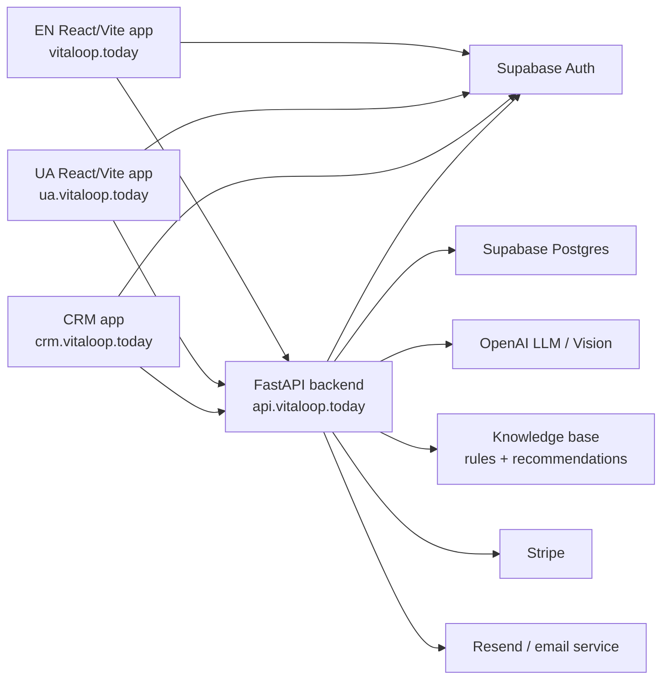

# VITALOOP Technical Architecture: EN + UA

Last updated: 2026-07-09  
Source: current repository implementation in `/Users/oleksii/projects/vitaloop`

## 1. Scope

This document describes the live product architecture for VITALOOP across the English and Ukrainian product surfaces, including the public site, authenticated cabinet, authentication lifecycle, role routing, backend APIs, data storage, integrations, deployment boundaries, and sign-in through sign-out behavior.

The second companion document, `VITALOOP_LAB_ANALYSIS_PIPELINE.md`, describes the lab-upload, biomarker extraction, validation, knowledge-base evaluation, reporting, protocol, progress, and prediction logic.

## 2. Product Surfaces

VITALOOP is split into several user-facing surfaces that share the same backend, identity provider, and data layer.

| Surface | Primary domain | Purpose | Main implementation |
| --- | --- | --- | --- |
| EN public site | `https://vitaloop.today` | Marketing, SEO pages, pricing, health hub, public funnel | React/Vite frontend in `frontend/` |
| EN cabinet | `https://vitaloop.today/dashboard` and protected routes | End-user health cabinet: onboarding, symptoms, upload, results, protocol, progress | React/Vite frontend in `frontend/` |
| UA public site | `https://ua.vitaloop.today` | Ukrainian localized landing and public funnel | Separate UA deployment/repo; shares API and auth |
| UA cabinet | `https://ua.vitaloop.today/dashboard` and protected routes | Ukrainian localized cabinet for the same backend product | Separate UA deployment/repo; same API contracts |
| API | usually `https://api.vitaloop.today` | FastAPI backend for auth context, uploads, analysis, reports, dashboard, profile, billing, CRM APIs | `backend/app` |
| CRM | `https://crm.vitaloop.today` | Internal/ops/practitioner workflows | ASP.NET MVC app plus FastAPI admin/CRM endpoints |

The EN and UA products must remain logically separate at the presentation layer, but they share user identity, account state, entitlements, lab data, analysis pipeline, and knowledge-base logic.

## 3. High-Level Runtime Architecture

Core principles:

- Supabase Auth is the identity source. The frontend obtains a Supabase session and sends the bearer token to the API.
- The FastAPI backend validates the token using Supabase JWKS and resolves account, role, profile, entitlements, and ownership.
- EN and UA send locale through `Accept-Language` and `X-Vitaloop-Locale`; the backend uses this for localized analysis/report copy.
- The file named `claude_service.py` is legacy naming. The active LLM provider is OpenAI through `settings.active_llm_*`.
- Medical output is framed as educational decision support, not diagnosis.

## 4. Frontend Architecture

### 4.1 EN React/Vite app

The EN frontend is a React/Vite SPA under `frontend/`.

Important modules:

- `frontend/src/App.jsx`: route registry, protected-route gating, onboarding gating, public/cabinet/CRM route split.
- `frontend/src/hooks/useAuth.js`: Supabase session hydration, sign-in, sign-up, Google OAuth, password reset, sign-out.
- `frontend/src/api/client.ts`: Axios client, bearer token injection, locale headers, error handling, paywall event.
- `frontend/src/auth/postLogin.js`: post-login destination resolution for B2C end users vs CRM roles.
- `frontend/src/lib/supabase.js`: Supabase browser client and fallback handling.

### 4.2 UA frontend

The UA product is served from `ua.vitaloop.today` and should use Ukrainian copy, Ukrainian UX, and Ukrainian public routes. It shares:

- Supabase Auth project.
- FastAPI API.
- User account, profile, subscription, lab uploads, biomarkers, protocols, progress, and knowledge-base outputs.
- Locale-aware backend responses through `X-Vitaloop-Locale: uk`.

The UA presentation layer must not fall back to stale EN pages or old public-page shells. Any UA protected route should remain in the UA app shell while calling the same backend APIs.

### 4.3 API Client Behavior

The frontend API client:

- Uses `VITE_API_BASE_URL`, `VITE_API_URL`, or `/api`.
- Resolves the Supabase access token from `supabase.auth.getSession()`.
- Falls back to reading the token from localStorage if needed.
- Adds:
  - `Authorization: Bearer <token>`
  - `Accept-Language`
  - `X-Vitaloop-Locale`
- Retries a 401 once for non-auth-boundary requests.
- Treats `/auth/me` as the auth boundary:
  - If token is missing, it rejects without forced navigation.
  - If token exists but `/auth/me` still returns 401 after retry, it signs out and redirects to `/login`.
- Handles 402 by dispatching `paywall:trigger`.
- Suppresses toast noise for passive cabinet refresh endpoints such as `/dashboard/summary`, `/progress`, `/timeline`, `/insights`, and `/assignments`.

## 5. Backend Architecture

### 5.1 FastAPI Application

The backend is a FastAPI app in `backend/app/main.py`. It installs middleware for:

- Request context and structured logging.
- Security headers.
- Path-level rate limiting.
- CORS including locale headers.

Major router groups:

- `/auth`: account context, entitlements, subscription, registration notifications, organization onboarding.
- `/auth/onboarding`: onboarding state, complete, skip.
- `/profile`: profile and location read/update.
- `/settings`: user settings.
- `/analyze`: lab text/file/manual analysis.
- `/protocol`: protocol generation and cached protocol reads.
- `/progress`: biomarker progress and trends.
- `/symptoms`: symptom recording and summaries.
- `/assessment`: public/UA assessment flows.
- `/checkins`: weekly check-ins.
- `/timeline`: user activity timeline.
- `/insights`: generated insights.
- `/notifications`: notification preferences.
- `/uploads`: upload listing/support endpoints.
- `/dashboard`: authenticated dashboard summary.
- `/stripe`: billing/subscription flows.
- `/admin`, `/crm`, `/assignments`: admin, CRM, practitioner, and assignment workflows.
- `/v1/b2b/analyze-labs` and partner routers: partner-facing lab analysis APIs.
- Knowledge routers: knowledge-base and rule evaluation APIs.

### 5.2 Authentication and Authorization

Backend authentication is implemented through dependency functions in `backend/app/dependencies.py`.

`get_current_user`:

- Reads the bearer token from `Authorization`.
- Validates Supabase JWT using JWKS.
- Expects the Supabase `authenticated` audience.
- Returns the current user context including `sub`, email, roles, metadata, and membership hints.

`require_active_subscription`:

- Resolves account entitlements.
- Allows non-end-user roles to bypass B2C subscription gates.
- For end users, requires active subscription/premium entitlement.
- Returns HTTP 402 with code `SUBSCRIPTION_REQUIRED` when gated.

`require_freemium_analyze`:

- Allows CRM/admin/non-end-user roles and premium end users.
- For free end users, checks the freemium biomarker quota via `BiomarkerService.check_freemium_biomarker_quota`.
- Returns 402 when the biomarker quota is exceeded.

Ownership checks:

- Upload-specific reads and protocol creation call `assert_upload_belongs_to_user(upload_id, user_id)`.
- User-facing medical rows are always scoped by `user_id`.

### 5.3 Roles

The app recognizes B2C and CRM roles:

- End user: `end_user`.
- CRM/ops roles: `super_admin`, `admin`, `org_admin`, `org_owner`, `client_admin`, `manager`, `practitioner`.

Role resolution is performed in `/auth/me` and post-login logic. New users without explicit business metadata are automatically treated as `end_user`, and a row is upserted into `users` when needed.

## 6. Sign In / Sign Up / Sign Out Flow

### 6.1 Sign Up with Email

Frontend flow:

1. User opens `/login?signup=true` or `/register`.
2. `/register` redirects to `/login?signup=true`.
3. `Login.jsx` validates email and password.
4. Password baseline requires at least 8 characters with letters and numbers.
5. `useAuth.signUpWithEmail(email, password)` calls Supabase `auth.signUp`.
6. Email confirmation redirect points to `/auth/confirmation` unless overridden by `VITE_EMAIL_CONFIRMATION_PATH`.
7. After confirmation/login, frontend resolves post-login destination.

Backend follow-up:

- `/auth/registration/notify` can send internal registration alert and welcome email for recent accounts.
- `/auth/me` ensures account context exists and resolves role/onboarding/subscription state.

### 6.2 Sign In with Email

1. User submits email/password.
2. Frontend calls Supabase `signInWithPassword`.
3. Supabase stores the session in browser storage.
4. The app calls `resolvePostLoginDestination`.
5. The destination depends on role and onboarding state:
   - End user with incomplete onboarding: `/onboarding`.
   - End user with completed onboarding: `/dashboard`.
   - Safe return URLs for `/dashboard`, `/onboarding`, or `/subscription` are respected.
   - CRM roles are handed to CRM via `/auth/post-login`.

### 6.3 Google OAuth

1. Frontend calls Supabase `signInWithOAuth({ provider: "google" })`.
2. Redirect destination is `AUTH_POST_LOGIN_PATH`.
3. After OAuth, role resolution follows the same B2C-vs-CRM logic.

### 6.4 Password Reset

1. Frontend calls Supabase `resetPasswordForEmail`.
2. Redirect target is `/login?reset=true`.
3. The user completes password reset through Supabase and returns to the app.

### 6.5 Session Hydration

`useAuth` bootstraps session with `supabase.auth.getSession()`.

- A 4-second timeout prevents protected routes from hanging forever.
- `onAuthStateChange` updates the local user state.
- Protected routes show `AppLoadingScreen` while auth is loading.
- If no user is present, protected routes redirect to `/login`, preserving `returnUrl` and adding `locale=uk` when the current locale is Ukrainian.

### 6.6 Post-Login Routing

`resolvePostLoginDestination`:

- Calls `/auth/me` to get account context.
- Keeps `end_user` inside the B2C app.
- Sends CRM users to CRM through a hidden POST token handoff.
- Falls back to Supabase session metadata if `/auth/me` is temporarily unavailable.

This is important because the same Supabase identity can be used by both B2C cabinet and CRM/ops users.

### 6.7 Sign Out

Frontend sign-out:

1. Best-effort POST to CRM `/auth/logout` with credentials to clear sticky CRM cookies.
2. Supabase `auth.signOut()`.
3. Local app receives auth-state change and protected routes redirect to `/login`.

The API does not own the browser session. It only validates Supabase tokens supplied by the frontend.

## 7. Cabinet Route Model

### 7.1 Protected Routes

The cabinet is behind `ProtectedRoute`, which requires a Supabase user. End-user medical flows also use `EndUserFlowRoute`, which can require onboarding completion.

Core cabinet routes:

- `/dashboard`: user health dashboard.
- `/onboarding`: account and health-loop setup.
- `/health-profile`: profile, anthropometrics, goals, medications, diagnoses.
- `/questionnaire`: symptom/lifestyle questionnaire.
- `/upload`: lab report upload.
- `/lab-results`: uploaded lab history.
- `/results/:uploadId`: detailed report/result screen.
- `/protocol/:uploadId`: protocol/action plan for an upload.
- `/insights`: generated insights.
- `/assignments`: tasks/actions assigned from protocols or practitioners.
- `/check-ins`: weekly check-in flow.
- `/settings`: account, notifications, privacy, preferences.
- `/subscription` and `/billing-history`: billing and plan management.

### 7.2 Onboarding State

The backend endpoint `/auth/onboarding/state` evaluates:

- Role.
- `user_profile.onboarding_complete`.
- Required profile basics: `age`, `sex`, `height_cm`, `weight_kg`.
- Location.
- Recurring complaints.
- First lab upload.
- Completed questionnaire.

For end users, the current stage can be:

- `profile`
- `location`
- `complaints`
- `upload`
- `questionnaire`
- `review`
- `complete`

The health loop is tracked separately from account setup:

- `account_setup_complete`
- `first_health_loop_started`
- `first_health_loop_complete`

### 7.3 Dashboard Summary

`GET /dashboard/summary` composes a cabinet summary using:

- Account and profile.
- Entitlements.
- Onboarding state.
- Progress data.
- Insights.
- Health score and delta.
- Weekly check-in and questionnaire.
- Assignments.
- Upload count.
- Next-best action.
- Start-here block for new or incomplete users.

It has a 45-second in-memory per-user TTL cache to reduce repeated load.

## 8. User Profile and Medical Context

Profile APIs live under `/profile`.

Supported user profile fields include:

- `full_name`
- `age`
- `sex`
- `height_cm`
- `weight_kg`
- `goals`
- `timezone`
- `medications`
- `allergies`
- `pregnancy_status`
- `current_supplements`
- `current_medications`
- `prior_diagnoses`
- `knowledge_learning_consent`
- `onboarding_complete`

Location fields:

- `district`
- `city`
- `state`
- `country`

The lab-analysis API requires `age`, `sex`, `height_cm`, and `weight_kg` before file/text analysis. This is intentional because pediatric/adult interpretation and safety context depend on anthropometric data.

## 9. Data Model: Conceptual Tables

The backend uses Supabase Postgres. The exact schema is migration-driven, but the implementation references these conceptual entities:

- `users`: account identity, email, name, global role.
- `user_profile`: anthropometrics, health goals, medical context, onboarding flags, consent.
- `user_locations`: user location context.
- `lab_uploads`: uploaded/processed lab reports and metadata.
- `biomarkers`: extracted biomarkers linked to uploads and users.
- `protocols`: saved recommendation/protocol output for an upload.
- `recurring_complaints`: symptom-first complaints.
- `symptoms`: upload-linked or standalone symptom records.
- `questionnaire_sessions`: completed questionnaires.
- `checkins_weekly`: weekly self-reported progress.
- `health_scores`: generated health score history.
- `assignments`: active/completed action items.
- `insights`: generated insights.
- `timeline_events`: cabinet timeline.
- `knowledge_rules`: active rule engine rules.
- `recommendations`: rule-linked recommendation copy/actions.
- `rule_evaluations`: persisted knowledge-rule evaluation results.
- `audit_logs`: medical-read/create/update audit trail.
- Stripe-related subscription/customer tables.
- CRM organization, membership, practitioner/client tables.

## 10. Locale and EN/UA Separation

The locale stack works at three levels:

1. Frontend route/domain: `vitaloop.today` vs `ua.vitaloop.today`.
2. API request headers: `Accept-Language` and `X-Vitaloop-Locale`.
3. Backend report copy: report builders map locale `uk` to Ukrainian output, status labels, disclaimers, and rule/recommendation translations where available.

UA-specific requirements:

- UA pages must be Ukrainian by default.
- UA login/register should keep Ukrainian context through query params such as `locale=uk`, `lang=uk`, or `from=ua`.
- UA cabinet should call the same API but preserve UA shell/design.
- Shared entitlements mean Premium/free status is account-level, not domain-level.

## 11. External Integrations

### Supabase

Used for:

- Auth.
- JWT/JWKS validation.
- Postgres data store.
- Service-role backend access.
- Browser-session storage in the frontend.

### OpenAI

Used for:

- Biomarker extraction from raw lab text.
- Vision analysis for image/scanned lab reports where enabled.
- Protocol generation.
- JSON-only LLM outputs controlled by prompts in `backend/app/prompts`.

The active provider is configured by `settings.active_llm_api_key`, `settings.active_llm_model`, and `settings.active_llm_base_url`.

### Stripe

Used for:

- Subscription status.
- Premium/free entitlement resolution.
- Checkout/billing flows.

### Email Provider

Used for:

- Welcome email.
- Registration alert email.
- Other transactional notifications.

### Sentry / Logging

Sentry is optional. Structured logs and audit logs are used for backend observability and medical-output traceability.

## 12. Security and Privacy Controls

Implemented controls:

- Bearer JWT validation through Supabase JWKS.
- User-scoped database access in service functions.
- Upload ownership checks before protected reads/generation.
- Subscription and freemium quota gates.
- CORS allow-list.
- Security headers.
- Rate limiting.
- Audit logging for medical reads/outputs.
- Educational disclaimers on report outputs.
- Safety alerts escalated to medical review language rather than diagnosis.
- Deidentified person avatar for knowledge evaluation: age band, sex, BMI band, goals, and consent flag rather than raw full profile.

Important product constraint:

- VITALOOP must not present itself as a diagnostic system. It provides educational analysis, prioritization, questions for doctors, retest planning, and health-action support.

## 13. Deployment Boundaries

Current deployment model:

- EN frontend builds to static `dist` and is served by web server/nginx.
- UA frontend is deployed separately for `ua.vitaloop.today`.
- FastAPI backend is deployed as a long-running service behind API domain/nginx.
- CRM is a separate ASP.NET MVC deployment.

Operational checks after deploy should include:

- `build-info.json` or equivalent frontend fingerprint.
- Fresh browser load with service worker/cache considerations.
- Protected route smoke with real Supabase user.
- API route checks with bearer token.
- UA route checks to ensure no old SPA shell is served.

## 14. Cabinet Lifecycle: End-to-End

1. User visits EN or UA public site.
2. User clicks start/sign up/login.
3. User authenticates through Supabase email/password or OAuth.
4. Frontend resolves post-login destination.
5. `/auth/me` returns account, role, onboarding, and entitlement context.
6. End user is routed to onboarding if account setup is incomplete.
7. User fills profile basics and medical context.
8. User records symptoms/complaints and/or uploads lab report.
9. Backend validates user, profile, quota, upload ownership, and file/text input.
10. Backend extracts biomarkers, normalizes values, evaluates knowledge-base rules, builds report/protocol, stores results.
11. User views result, report, priority markers, recommendations, doctor questions, and retest schedule.
12. User uses dashboard, assignments, progress, check-ins, and insights to continue the health loop.
13. User can manage profile/settings/subscription.
14. User signs out, clearing Supabase session and best-effort CRM cookies.

## 15. Current Architectural Risks / Notes

- `claude_service.py` is a legacy filename and can confuse maintainers because the active provider is OpenAI. Renaming would require a careful import migration.
- UA must avoid stale route shells. A mixed old/new SPA on UA creates broken navigation and stale UX.
- The quality of analysis depends on complete profile context and correct biomarker extraction. The API now blocks analysis until key anthropometric fields are present.
- Knowledge-base output quality depends on active `knowledge_rules` and `recommendations` content.
- Freemium/Premium gates must remain account-level and consistent across EN/UA.
- Medical safety wording must stay conservative: possible links, priority, discussion with clinician, retest plan.

## 16. Shared Health Intelligence Core

EN, UA, and B2B now use the same backend analysis core. Presentation and locale differ by frontend/domain, but the health-intelligence artifacts are shared:

- `health_context`
- `health_states`
- `trend_analysis`
- `ai_orchestration`
- enriched `protocol`
- `quality_snapshot`

This means improvements to domain scoring, KB rules, safety context, protocol enrichment, and trend analysis benefit EN, UA, and partner API clients together.

## 17. Managed KB Domain Registry

The domain model is governed through `knowledge_domain_registry` in Supabase, with code fallback for availability.

Runtime behavior:

1. Backend attempts to load active managed rows from Supabase.
2. If rows are available, health-state scoring and protocol enrichment use them.
3. If Supabase is unavailable or the table has no active rows, backend falls back to the versioned code registry.

The managed registry currently controls domain aliases, required markers, retest markers, protocol sections, expected timelines, evidence levels, and clinician-escalation hints.

Operational requirement:

- Changes to managed domains should be reviewed as KB/medical content changes.
- Keep `governance_status='active'` only for reviewed rows.
- Monitor `analysis_core_completed` logs for registry source/version/domain count and AI fallback rate.
