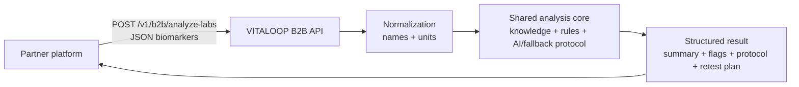

# VITALOOP Partner API Package

This package is the partner-facing integration bundle for the VITALOOP B2B Analyze Labs API.

## What The API Does

External platforms send parsed blood test biomarkers as JSON. VITALOOP normalizes the data, runs the shared analysis core, evaluates knowledge/rules, generates safety flags, recommendations, protocol sections, retest suggestions, and returns structured JSON back to the partner platform.



## Files

- `../openapi/b2b-api.yaml` - OpenAPI 3.0 contract, source of truth for API references.
- `../b2b-api.md` - detailed implementation notes and operational guidance.
- `examples/analyze-labs-request.json` - sample request.
- `examples/analyze-labs-response.json` - sample response.
- `postman/vitaloop-b2b-api.postman_collection.json` - Postman smoke collection.
- `brief/vitaloop-b2b-api-partner-brief.md` - short partner brief.
- `brief/georgiana-demo-flow.md` - non-code demo flow.
- `staging-readiness.md` - staging deployment checklist.

## Endpoint

```http
POST https://api.vitaloop.today/v1/b2b/analyze-labs
```

Pilot compatibility alias:

```http
POST https://api.vitaloop.today/b2b/analyze-labs
```

Use `/v1/b2b/analyze-labs` for new integrations.

## Authentication

Every request must include:

```http
X-Partner-Api-Key: <partner_api_key>
Content-Type: application/json
```

Optional idempotency:

```http
X-Idempotency-Key: partner-order-abc-001
```

Do not send `partner_id`. VITALOOP resolves tenant identity from the API key.

## PHI/GDPR Notes

- Prefer opaque `external_user_id` values.
- Avoid unnecessary PHI in `metadata`.
- VITALOOP minimizes raw payload storage during the pilot.
- Partner retention is controlled by `partners.b2b_retention_days`.
- Export/delete is operator-run during the pilot.

## Documentation Update Flow

1. Edit `docs/openapi/b2b-api.yaml`.
2. Validate the OpenAPI file.
3. Commit and push to GitHub.
4. Scalar updates the API reference from GitHub/raw URL or Git sync.
