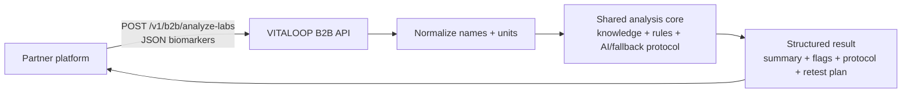

# VITALOOP B2B Analyze Labs API

This is the single partner-facing documentation hub for integrating with the VITALOOP B2B Analyze Labs API.

Use this page as the main link for partners and developers.

## One-Line Summary

Partner platforms send parsed blood biomarkers as JSON. VITALOOP processes them through its analysis engine and returns structured health insights, priorities, flags, protocol sections, retest suggestions, and doctor summary.



## Current Scope

This API is ready for a controlled external pilot with trusted partners.

- JSON biomarkers only.
- No PDF/file upload in this endpoint yet.
- API access is private and issued per partner.
- Use the versioned endpoint for new integrations.

## Endpoint

```http
POST https://api.vitaloop.today/v1/b2b/analyze-labs
```

Pilot/deprecated compatibility alias:

```http
POST https://api.vitaloop.today/b2b/analyze-labs
```

## Authentication

Every request must include:

```http
X-Partner-Api-Key: <partner_api_key>
Content-Type: application/json
```

Optional idempotency header:

```http
X-Idempotency-Key: partner-order-abc-001
```

Do not send `partner_id`. VITALOOP resolves the partner tenant from the API key.

## Start Here

1. Read the short partner brief: [`brief/vitaloop-b2b-api-partner-brief.md`](brief/vitaloop-b2b-api-partner-brief.md)
2. Review the OpenAPI contract: [`../openapi/b2b-api.yaml`](../openapi/b2b-api.yaml)
3. Check the example request: [`examples/analyze-labs-request.json`](examples/analyze-labs-request.json)
4. Check the example response: [`examples/analyze-labs-response.json`](examples/analyze-labs-response.json)
5. Run the Postman collection: [`postman/vitaloop-b2b-api.postman_collection.json`](postman/vitaloop-b2b-api.postman_collection.json)
6. Follow the smoke test guide: [`smoke-test-guide.md`](smoke-test-guide.md)

## Files In This Package

| File | Purpose |
| --- | --- |
| [`../openapi/b2b-api.yaml`](../openapi/b2b-api.yaml) | OpenAPI 3.0 contract and source of truth for tooling. |
| [`../b2b-api.md`](../b2b-api.md) | Detailed technical and operational API notes. |
| [`brief/vitaloop-b2b-api-partner-brief.md`](brief/vitaloop-b2b-api-partner-brief.md) | Short non-technical brief for partners. |
| [`brief/vitaloop-b2b-api-partner-brief.pdf`](brief/vitaloop-b2b-api-partner-brief.pdf) | PDF version of the partner brief. |
| [`brief/capacity-lab-demo-flow.md`](brief/capacity-lab-demo-flow.md) | Capacity Lab / Georgiana demo flow. |
| [`examples/analyze-labs-request.json`](examples/analyze-labs-request.json) | Example request body. |
| [`examples/analyze-labs-response.json`](examples/analyze-labs-response.json) | Example response body. |
| [`postman/vitaloop-b2b-api.postman_collection.json`](postman/vitaloop-b2b-api.postman_collection.json) | Postman collection for developers. |
| [`smoke-test-guide.md`](smoke-test-guide.md) | Step-by-step technical smoke test. |
| [`staging-readiness.md`](staging-readiness.md) | Checklist before giving a staging key to a partner. |
| [`scalar-publishing.md`](scalar-publishing.md) | Optional Scalar publishing notes. Scalar is not required. |

## What The Partner Sends

```json
{
  "external_user_id": "partner-user-123",
  "biomarkers": [
    {
      "name": "Ferritin",
      "value": 12,
      "unit": "ng/mL",
      "reference_range": "30-150"
    }
  ],
  "symptoms": ["fatigue", "low energy"],
  "questionnaire": {
    "sleep_hours": 6
  },
  "idempotency_key": "partner-order-abc-001"
}
```

## What VITALOOP Returns

The response includes:

- `analysis_id`
- `health_summary`
- `prioritized_biomarkers`
- `risks_flags`
- `recommendations`
- `protocol`
- `retest_suggestions`
- `doctor_summary`
- `knowledge_evaluation`
- `disclaimer`
- `metadata`

See the full example: [`examples/analyze-labs-response.json`](examples/analyze-labs-response.json)

## Security And Usage Controls

The pilot API includes:

- partner API keys;
- required `labs:analyze` scope;
- tenant isolation by API key;
- optional partner IP allowlist;
- optional Cloudflare-required mode;
- Redis-backed rate limiting;
- idempotency handling;
- audit events;
- Prometheus metrics;
- minimized raw payload storage for pilot PHI/GDPR control.

## Suggested Message To Send A Partner

```text
Hi Georgiana,

Here is the VITALOOP B2B API documentation package for your developers:

https://github.com/softdabtech/vitaloop/tree/main/docs/partner-api-package

The integration flow is simple:
your platform sends parsed blood biomarkers as JSON → VITALOOP processes them → your platform receives structured analysis, priorities, risks, protocol, retest suggestions and doctor summary.

For the first pilot, we support JSON biomarkers only. PDF/file upload is intentionally not included in this endpoint yet.

Your developers can start with the README, OpenAPI file, example request/response and Postman collection.

Best,
Alex
```

## Documentation Update Flow

1. Update the OpenAPI contract: [`../openapi/b2b-api.yaml`](../openapi/b2b-api.yaml)
2. Update the detailed docs: [`../b2b-api.md`](../b2b-api.md)
3. Update examples if the request or response changed.
4. Update this README if partner-facing navigation changed.
5. Validate JSON examples and OpenAPI references.
6. Commit and push to GitHub.

## Current Git Reference

Latest partner API documentation package commit:

```text
631f739d Add B2B partner API documentation package
```

B2B API hardening commit:

```text
d6e2a739 Add B2B analyze labs API hardening
```
