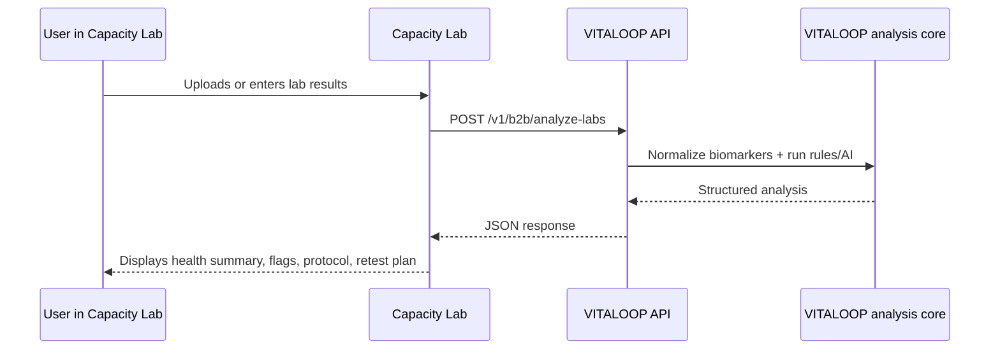

# Capacity Lab Demo Flow

## Message

VITALOOP can act as a blood-analysis API provider behind Capacity Lab.

Capacity Lab users stay inside the Capacity Lab product. Capacity Lab sends parsed biomarker JSON to VITALOOP. VITALOOP returns structured analysis that Capacity Lab can display in its own UX.

## Simple Diagram

## What To Show

1. Capacity Lab sends:
   - `external_user_id`
   - biomarkers JSON
   - optional symptoms/questionnaire

2. VITALOOP returns:
   - health summary
   - prioritized biomarkers
   - risks/flags
   - protocol
   - retest suggestions
   - doctor summary
   - disclaimer

3. Capacity Lab keeps control of:
   - user account
   - frontend UX
   - billing relationship
   - product journey

4. VITALOOP provides:
   - analysis engine
   - knowledge/rules layer
   - structured clinical decision-support JSON
   - API security, idempotency, audit, rate limiting

## Demo Script

"Your platform remains the user-facing product. VITALOOP runs behind the scenes as an analysis API. You send us parsed blood test data, and we return structured insights your platform can render directly: summary, abnormal biomarkers, risks, protocol, retest plan, and disclaimer."

## Pilot Ask

- Agree on one test data format.
- Create one staging API key.
- Run 5 smoke tests.
- Render the returned JSON in the Capacity Lab product prototype.
