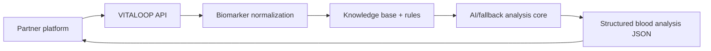

# VITALOOP B2B Analyze Labs API

## Partner Brief

VITALOOP can work as an analysis provider for external health, wellness, lab, and coaching platforms.

The partner platform sends structured blood test biomarkers to VITALOOP via API. VITALOOP normalizes the data, applies its knowledge base, rules, safety evaluation, AI/fallback protocol generation, and returns a structured analysis result that can be shown inside the partner product.

## Integration Flow



## Endpoint

```http
POST /v1/b2b/analyze-labs
```

## Input

- partner-scoped `external_user_id`
- biomarker list as JSON
- optional symptoms
- optional questionnaire
- optional safe metadata

VITALOOP does not require the partner to create a VITALOOP user account.

## Output

- health summary
- prioritized biomarkers
- risks and flags
- recommendations
- protocol sections
  - nutrition
  - supplements
  - lifestyle
  - training/recovery
- retest suggestions
- doctor summary
- medical disclaimer
- analysis metadata

## Security

- API key authentication with `X-Partner-Api-Key`
- required scope: `labs:analyze`
- tenant isolation by resolved partner API key
- optional partner IP allowlist
- Cloudflare WAF recommended before public launch
- Redis-backed rate limiting by partner and API key
- idempotency via `X-Idempotency-Key`

## PHI/GDPR

- partners should use opaque `external_user_id` values
- avoid unnecessary PHI in metadata
- VITALOOP minimizes raw payload storage during the pilot
- retention is partner-configurable
- export/delete workflow is operator-run for pilot partners

## Pilot Status

The current implementation is suitable for a controlled pilot with 1-2 trusted partners after staging deployment and live smoke testing.

Before production partner traffic:

- apply database migration
- configure Redis rate limiting
- configure Cloudflare rules
- create one test partner API key
- run smoke tests against staging
