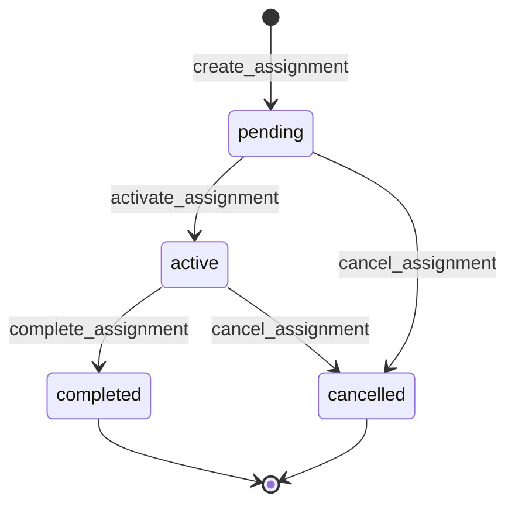

# Stage 7: Practitioner <-> Client Assignments

## 1) Lifecycle Diagram

## 2) Role Matrix

| Action | super_admin | org_admin/org_owner/client_admin/manager | practitioner (self) | end_user (self as client) |
|---|---|---|---|---|
| Create assignment | yes | yes | no | no |
| Activate assignment | yes | yes | no | no |
| Complete assignment | yes | yes | no | no |
| Cancel assignment | yes | yes | yes (own assignment only) | no |
| Read assignment | yes | yes (org-scoped) | yes (own assignment only) | yes (own client record only) |
| List assignments | yes | yes (org-scoped) | yes (own assignments only) | yes (own client assignments only) |

## 3) Capacity Management

Capacity is enforced in DB trigger `sync_practitioner_capacity_from_assignments`:
- insert with `status='active'` increments `practitioners.current_clients`
- update `pending -> active` increments
- update `active -> completed/cancelled` decrements
- increment path raises exception when `current_clients >= max_clients`

This makes capacity atomic and race-safe at database level.

## 4) API Contract

### POST /crm/assignments
Request body:
- `practitioner_id: UUID`
- `client_user_id: UUID`
- `organization_id: UUID`
- `notes?: string`

Response: `AssignmentResponse`

### PATCH /crm/assignments/{assignment_id}/activate
Response: `AssignmentResponse`

### PATCH /crm/assignments/{assignment_id}/complete
Response: `AssignmentResponse`

### PATCH /crm/assignments/{assignment_id}/cancel
Response: `AssignmentResponse`

### GET /crm/assignments
Query params:
- `practitioner_id?`
- `client_user_id?`
- `status?`
- `org_id?`

Response: `AssignmentListResponse`

### GET /crm/assignments/{assignment_id}
Response: `AssignmentResponse`

## 5) DB Schema

Table: `public.practitioner_assignments`
- `id`
- `practitioner_id`
- `client_user_id`
- `organization_id`
- `assigned_by`
- `status`
- `notes`
- `assigned_at`
- `activated_at`
- `completed_at`
- `created_at`
- `updated_at`

Indexes:
- `practitioner_id`
- `client_user_id`
- `organization_id`
- `status`

Uniqueness:
- partial unique index on `(practitioner_id, client_user_id)` for `status in ('pending', 'active')`

## 6) Edge Cases Handled

- Duplicate assignment prevention via partial unique index and pre-insert service check
- Capacity overflow prevention via atomic trigger-level check
- Practitioner self-cancel for own assignments
- Org boundary enforcement via org membership scope and assignment access dependency
- State transition validation for activate/complete/cancel

## 7) Files Created/Modified

Created:
- `backend/sql/stage-7-practitioner-assignments.sql`
- `backend/app/schemas/assignment.py`
- `backend/app/services/assignment_service.py`
- `backend/app/routers/assignments.py`
- `docs/stage-7-assignments.md`

Modified:
- `backend/app/dependencies_crm.py`
- `backend/app/main.py`
